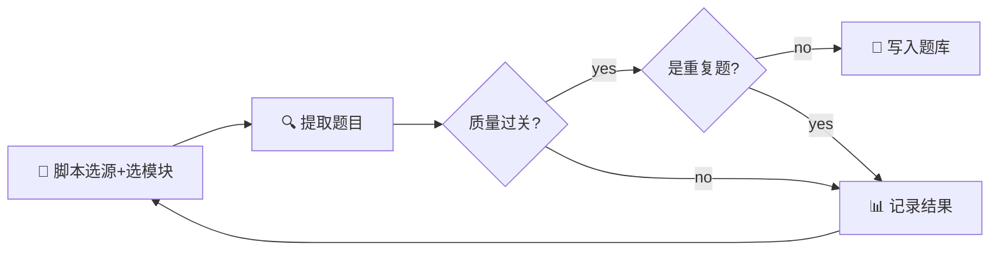

# bank_collector.py — 搜集 Loop 集成指南

## 架构



## 两种运行模式

### 模式 A：Loop 模式（cron 场景，LLM 配合）

```bash
python3 scripts/bank_collector.py --loop --target 35 --max-iter 10
```

脚本输出 LLM 提取指令，LLM 执行 web_search/curl 后调用 `--inject` 入库。

### 模式 B：直接注入（已有 JSON 文件）

```bash
python3 scripts/bank_collector.py --inject /tmp/extracted.json --source github_llm_interview --module M19_VLM多模态
```

## 数据源

### Y44 共享数据（优先）
| 源 ID | 文件路径 | 优先级 | 提取方式 |
|---|---|---|---|
| y44_github | /root/.hermes/shared/y44/github/repos.json | 0.95 | cat → 选仓库 → curl README |
| y44_nowcoder | /root/.hermes/shared/y44/nowcoder/sample_experiences.json | 0.90 | 读取 → 选 has_questions:true |
| y44_cnblogs | /root/.hermes/shared/y44/cnblogs/latest_posts.json | 0.70 | 读取 → 选 AI 主题 |

### 在线源（补充）
| 源 ID | 类型 | 优先级 |
|---|---|---|
| github_llm_interview | github_raw | 0.8 |
| nowcoder | search | 0.9 |
| juejin | search | 0.8 |

## Pre-flight 质量门控（11 项）
1. 题干非空
2. 题干≥10 字
3. 选项数=4
4. 选项非空
5. 选项不重复
6. 答案格式 A-D
7. 答案不越界
8. 无模板填充词
9. 无绝对化错误词
10. 长度偏见≤1.8x
11. 解析非空

## 源自适应
- 评分数据持久化到 `tracking/collector_state.json`
- 通过率 = 入库数 / 搜集数
- 高通过率源自动优先
